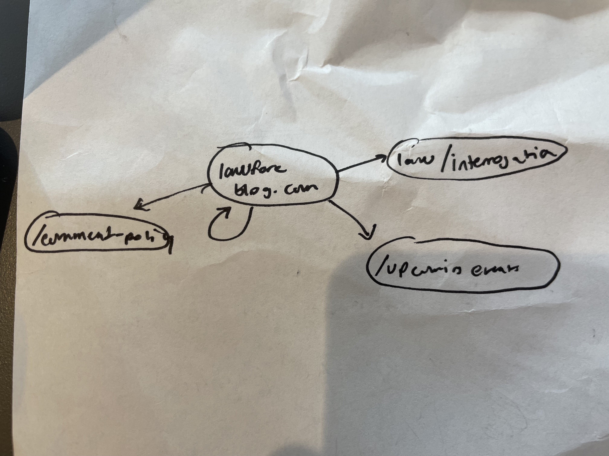

# Pagerank Project

In this project, I created a simple search engine for the website <https://www.lawfareblog.com>, which provides legal analysis on US national security issues.

This project is an exploration of the math concepts in the *Deeper Inside Pagerank* paper (added in this repo). The paper picks up after Sergey Brin and Larry Page's original 1998 paper detailing the algorithm that remains "the heart of [Google’s] software ... and continues to provide the basis for all of [their] web search tools”(http://www.google.com/technology/index.html).

The relevant math for my code is in sections 3 and 5. If this is your first time with Markov Chains, I recommend the first three videos in this short and simple youtube series: https://www.youtube.com/playlist?list=PLM8wYQRetTxBkdvBtz-gw8b9lcVkdXQKV

To summarize the math below: we're creating a web graph of sites as nodes and hyperlinks to create edges. Then, we create the corresponding adjacency matrix (ie P in the paper) and find its eigenvector (the stationary vector of a Markov chain). This stationary vector represents the distribution of the probability of visiting a site after an infinite random walk along the Markov chain. The sites with the highest probability of being visited are most likely to be useful to the user, and therefore, will be returned first! 

## Some intuition about the data and the webgraph 

The data file `lawfareblog.csv.gz` contains the lawfare blog's web graph! 
Let's take a look at the first 10 of these lines:
```
$ zcat data/lawfareblog.csv.gz | head
source,target
www.lawfareblog.com/,www.lawfareblog.com/topic/interrogation
www.lawfareblog.com/,www.lawfareblog.com/upcoming-events
www.lawfareblog.com/,www.lawfareblog.com/
www.lawfareblog.com/,www.lawfareblog.com/our-comments-policy
www.lawfareblog.com/,www.lawfareblog.com/litigation-documents-related-appointment-matthew-whitaker-acting-attorney-general
www.lawfareblog.com/,www.lawfareblog.com/topic/lawfare-research-paper-series
www.lawfareblog.com/,www.lawfareblog.com/topic/book-reviews
www.lawfareblog.com/,www.lawfareblog.com/documents-related-mueller-investigation
www.lawfareblog.com/,www.lawfareblog.com/topic/international-law-loac
```
In this file, the node names are URLs.
Semantically, each line corresponds to an HTML `<a>` tag that is contained in the source webpage and links to the target webpage. If we were to draw the graph for the first 4 of these entries, we'd get this: 



We can use the following command to count the total number of links/edges in the file:

```
$ zcat data/lawfareblog.csv.gz | wc -l
1610789
```

Every link corresponds to a non-zero entry in the `P` matrix - this is also the value of `nnz(P)`.
(we subtract 1 from this value since the `wc -l` command also counts the header line, not just the data lines.)

To get the dimensions of `P`, we need to count the total number of nodes in the graph, ie the number of unique links.
The following command achieves this by: decompressing the file, extracting the first column, removing all duplicate lines, then counting the results.
```
$ zcat data/lawfareblog.csv.gz | cut -f1 -d, | uniq | wc -l
25761
```
This matrix is large enough that computing matrix products could take several minutes on a single CPU.
Fortunately, however, the matrix is very sparse! This is because a single website will only contain a few hyperlinks - for every website it does NOT link, the entry in that column will be 0!
The following python code computes the fraction of entries in the matrix with non-zero values:
```
>>> 1610788 / (25760**2)
0.0024274297384360172
```
Thus, by using PyTorch's sparse matrix operations, we will be able to speed up the code significantly.

**Code Overview:**

The `pagerank.py` file contains code for loading the graph CSV files and searching through their nodes for key phrases.
For example, you can perform a search for all nodes (i.e. urls) that mention the string `corona` with the following command:
```
$ python3 pagerank.py --data=data/lawfareblog.csv.gz --verbose --search_query=corona
```

> **NOTE:**
> It will take about 10 seconds to load and parse the data files.
> All the other computation happens essentially instantly.


## Task 0: Setting-Up `P`, Line-By-Line explanation!
I'm going to go line-by-line through the code now. This is mostly for me because I forget how my code works after like 2 seconds. 

First, we have to make it a little easier to make nodes out of websites. The URLS are superrrr long, lets just number them and reference them by their number! 

Let's create some variables, ` self.url_dict`, `indices`, `target_counts`. 

```
class WebGraph():

    def __init__(self, filename, max_nnz=None, filter_ratio=None):
        '''
        Initializes the WebGraph from a file.
        The file should be a gzipped csv file.
        Each line contains two entries: the source and target corresponding to a single web link.
        This code assumes that the file is sorted on the source column.
        '''

        #actual code 
        self.url_dict = {}
        indices = []
        from collections import defaultdict
        target_counts = defaultdict(lambda: 0)
```
We want the `self.url_dict` as an instance variable - a dictionary specific to each WebGraph object QQ, used to store the mapping of URLs to its new name as a number. Let's say our CSV file is this: 

| source                | target                |
|-----------------------|-----------------------|
| www.example.com        | www.test.com        |
| www.example.com        | www.another.com       |
| www.another.com        | www.example.com       |

Then we want our `self.url_dict` to be a way to refer to our websites with a number instead of its full URL, like so: 

```
#an example 
self.url_dict = {
    'www.example.com': 0,
    'www.test.com': 1,
    'www.another.com': 2
}
```

With an easier way to reference each site, we can treat these numbers as the names of the nodes, and can now start to collect a list of the edges. If website 0 has links to both 1 and 2, and 2 has links to 0, then our `indices` will be:
```
#an example
indices = [[0, 1], [0, 2], [2, 0]]
#instead of ['www.example.com', 'www.test.com', 'www.another.com']
```
We can also start to count how many times a website has been the target, i.e another site has hyperlinked it within itself. 
```
#an example
target_counts = {
    0: 1,
    1: 1,
    2: 1
}
```
Now that we know what those are supposed to look like, let's start using our law blog's info to actually build the corresponding `self.url_dict`, `indices`, and `target_counts`. 

We open up the file and will now go through each row individually in our `for` loop, and use `i` as our counter of what row we are on in case we want to pass in a `max_nnz` that limits how many rows go up to. 

```
        # loop through filename to extract the indices
        logging.debug('computing indices')

        #reading the csv file 
        with gzip.open(filename,newline='',mode='rt') as f:
            # i will be the number of the row in the file
            # row will be the row itself 
            for i,row in enumerate(csv.DictReader(f)):

                #creating a limit of rows that it does this for if user specifies a value for max_nnz   
                if max_nnz is not None and i>max_nnz:
                    break
```

This code filters out links with lots of slashes, which usually is directories. 
```
                #this code skips over urls with a lot of slashes - these tend to be directories of links instead of sites themselves!
                import re
                regex = re.compile(r'.*((/$)|(/.*/)).*') #
                if regex.match(row['source']) or regex.match(row['target']):
                    continue
```

Ok, now we are finally building the `target_counts` and `indices`. This is using the WebGraph method `._url_to_index` from below, which is self-explanatory. Recall that our for loop is working on one row at a time. The line `source = self._url_to_index(row['source'])` is just using CSV's indexing format to create/set the variable `source` and `target`  to the left and right columns of the row our `for` loop is working on. With that set, we can update our `target_counts` and `indices`.
```
                source = self._url_to_index(row['source'])
                target = self._url_to_index(row['target'])
                target_counts[target] += 1
                indices.append([source,target])
```

Let's talk about this block of code later; assume that `filter_ratio is None` for now. 
```
     # remove urls with too many in-links
        if filter_ratio is not None:
            new_indices = []
            for source,target in indices:
                if target_counts[target] < filter_ratio*len(self.url_dict):
                    new_indices.append([source,target])
            indices = new_indices
```

Yay! We've stored the nodes in `self._url_dict`, have the edges of our graph in `indices`, and the in-link number in `target_counts`. Now, we can start computing the transition matrix. Recall that we want to store this as a sparse matrix - specifically, the `torch.sparse.FloatTensor`. 

Sparse matrices assume that most of the numbers in the matrix is 0, and so it only stores the location of the non-zeros and their corresponding values. We know from looking at our .csv that our 0th website will have two edges to the 1st and second. Thus, our matrix will have a 0.5 in the 0th row+1st column and in the 0th row+2nd column. That is specificaly the coordinate information stores as the first two values in `indices = [[0, 1], [0, 2], [2, 0]]` ! 

However, sparse matrices take in the indices with all of the row-coordinates in one list, and the y-coordinates in the other. Thankfully, all that takes is a quick transpose! Storing that transpose in `i`, we get 

```
#an example
i = [[0, 0, 2],   # Sources
     [1, 2, 0]]   # Targets
```

We will store this `i` in the `torch.LongTensor` for compability reasons, so our final code for creating indices:
```
        i = torch.LongTensor(indices).t()
```

We have the indices for our sparse matrix, but we still need to store what values to put in at those spots. This code for me is a little bit of a doozy to explain with words and I think the best way to get an idea of how `values` is beign made is to copy this specific block below into `https://pythontutor.com/visualize.html#mode=edit`: 

```
#example code to visualize making `values`
indices = [[0, 1], [0, 2], [2, 0]]

values = []
last_source = indices[0][0]
last_i = 0
for i,(source,target) in enumerate(indices+[(None,None)]):
    if source==last_source:
        pass
    else:
        total_links = i-last_i
        values.extend([1/total_links]*total_links)
        last_source = source
        last_i = i
```

SLAYYY now we've got both `indices` and `values`. Let's put it all together: 

```
        # generate the sparse matrix
        i = torch.LongTensor(indices).t()
        v = torch.FloatTensor(values)
        n = len(self.url_dict)
        self.P = torch.sparse.FloatTensor(i, v, torch.Size([n,n]))
```

And finally, we're going to create this dictionary: 
```
        self.index_dict = {v: k for k, v in self.url_dict.items()}
```

YAYYYY we're all set up with our `P` matrix. Now let's start doing some math. 

## The power method

We're using the power method to find the eigenvector ie the PageRank vector of the transition matrix `P`. Go to the paper for an explanation of some of the modifications we make to the raw transition matrix to make it primitive and irreducible and all. The main equation: 

$$ \textbf{x}^{(k)T} = (\alpha \textbf{x}^{(k-1)T})P +  [(\alpha \textbf{x}^{(k-1)T})\textbf{a} + (1 - \alpha)]\textbf{v}^T$$ 

The output of this function $\textbf{x}^{(k)T}$ is the PageRank vector itself! 

We're going to create a function with these inputs: 

```
 def power_method(self, v=None, x0=None, alpha=0.85, max_iterations=1000, epsilon=1e-6):
```

Let's just grab the dimension of the square matrix `P` real quick and store it in `n`: 
```            
        with torch.no_grad():
            n = self.P.shape[0]
```

Let's pass in the `v` personalization later - for now, all of the $n$ entries of this vector are going to be $\frac{1}{n}$. We're going to use matrix multiplication instead of matrix/vector multiplication, so we're going to use `torch.unsqueeze`  to add the dimension needed for matrix multiplication. 

```
            # create variables if none given
            if v is None:
                v = torch.Tensor([1/n]*n)
                # v = tensor([0.3333, 0.3333, 0.3333])
                v = torch.unsqueeze(v,1)
                # v = tensor([[0.3333],
                #            [0.3333],
                #            [0.3333]])

            # this line is redudant if we are creating v as above, as it will already be normalized.
            # this line specifically is to make sure that the user-passed personalization vector will work with the rest of the code 
            v /= torch.norm(v)
```

The user may also pass in an `x0` if there is a specific starting point, but otherwise, it will be assumed that there is an equal probabibility of starting on any site. 
```
            if x0 is None:
                x0 = torch.Tensor([1/(math.sqrt(n))]*n)
                x0 = torch.unsqueeze(x0,1)
            x0 /= torch.norm(x0)
```

Now, we need to make the $\textbf{a}$ vector to make $P$ stochastic and all. We know that every row that we've entered numbers into is already stochastic - thus, we just need to check for rows of all 0s. 

```
            stochastic_rows = torch.sparse.sum(self.P,1).indices()
            a = torch.ones([n,1])
            a[stochastic_rows]= 0
```

We have all the variables we need in our code. Now we put it together! We want to map our equation 

$$ \textbf{x}^{(k)T} = (\alpha \textbf{x}^{(k-1)T})P +  [(\alpha \textbf{x}^{(k-1)T})\textbf{a} + (1 - \alpha)]\textbf{v}^T$$ 

to `torch.addmm(input, mat1, mat2, *, beta=1, alpha=1, out=None)` which does: 

out = (beta * input) + (alpha * mat1 * mat2)

OMGG here we go! 
```
            # main loop
            xprev = x0
            x = xprev.detach().clone()
            for i in range(max_iterations):
                xprev = x.detach().clone()
                addend = (alpha * x.t() @ a + (1 - alpha)) * v.t()
                x = torch.sparse.addmm(
                    addend.t(),          
                    self.P.t(), 
                    x,             
                    beta=1,
                    alpha=alpha
                )       
                x /= torch.norm(x)
                residual = torch.norm(x-xprev)
                logging.debug(f'i={i} residual={residual}')

                # early stop when sufficient accuracy reached
                if residual < epsilon:
                    break

            #x = x0.squeeze()
            return x.squeeze()


```

Let's test it!! 

The command to run is 
```
python3 pagerank.py --data=data/lawfareblog.csv.gz
```

And this is the output! 

```
% python3 pagerank.py --data=data/lawfareblog.csv.gz
INFO:root:rank=0 pagerank=2.8741e-01 url=www.lawfareblog.com/about-lawfare-brief-history-term-and-site
INFO:root:rank=1 pagerank=2.8741e-01 url=www.lawfareblog.com/lawfare-job-board
INFO:root:rank=2 pagerank=2.8741e-01 url=www.lawfareblog.com/masthead
INFO:root:rank=3 pagerank=2.8741e-01 url=www.lawfareblog.com/litigation-documents-resources-related-travel-ban
INFO:root:rank=4 pagerank=2.8741e-01 url=www.lawfareblog.com/subscribe-lawfare
INFO:root:rank=5 pagerank=2.8741e-01 url=www.lawfareblog.com/litigation-documents-related-appointment-matthew-whitaker-acting-attorney-general
INFO:root:rank=6 pagerank=2.8741e-01 url=www.lawfareblog.com/documents-related-mueller-investigation
INFO:root:rank=7 pagerank=2.8741e-01 url=www.lawfareblog.com/our-comments-policy
INFO:root:rank=8 pagerank=2.8741e-01 url=www.lawfareblog.com/upcoming-events
INFO:root:rank=9 pagerank=2.8741e-01 url=www.lawfareblog.com/topics
```
It works! 

## Improving the search 
**Filtering out non-articles:**

Some of the highest-ranked sites are boring non-article pages such the root page <https://lawfareblog.com/>, or a table of contents <https://www.lawfareblog.com/topics>, or a subscribe page <https://www.lawfareblog.com/subscribe-lawfare>.

We see that our algorithm highly ranks pages with many in-links - pages likethe subscribe page will likely be hyperlinked at the bottom of each article!These pages therefore have a large pagerank, but usually when we are performing a web search, we only want articles.

This raises the question: How can we find the most important articles filtering out the non-article pages? The answer is to modify the `P` matrix by removing all links to non-article pages.One easy-to-implement method is to filter nodes by using their "in-link ratio" - the total number of edges with the node as a target (ie this site itself is hyperlinked in other sites) divided by the total number of nodes. Non-article pages often appear in the menu of a webpage, and therefore have links from almost all of the other webpages - thus, their in-link ratio is very high. 

The `--filter_ratio` parameter causes the code to remove all pages that have an in-link ratio larger than a value that we choose! Let's see the code that does this - we glossed over it the first time we read it. 

```
     # remove urls with too many in-links
        if filter_ratio is not None:
            new_indices = []
            for source,target in indices:
                if target_counts[target] < filter_ratio*len(self.url_dict):
                    new_indices.append([source,target])
            indices = new_indices
```

Let's use the filter ratio parameter, with a chosen ratio cap of 0.2. The command to run: 
```
python3 pagerank.py --data=data/lawfareblog.csv.gz --filter_ratio=0.2
```

which yields these results: 
```
% python3 pagerank.py --data=data/lawfareblog.csv.gz --filter_ratio=0.2
INFO:root:rank=0 pagerank=3.4697e-01 url=www.lawfareblog.com/trump-asks-supreme-court-stay-congressional-subpeona-tax-returns
INFO:root:rank=1 pagerank=2.9522e-01 url=www.lawfareblog.com/livestream-nov-21-impeachment-hearings-0
INFO:root:rank=2 pagerank=2.9040e-01 url=www.lawfareblog.com/opening-statement-david-holmes
INFO:root:rank=3 pagerank=1.5179e-01 url=www.lawfareblog.com/lawfare-podcast-ben-nimmo-whack-mole-game-disinformation
INFO:root:rank=4 pagerank=1.5100e-01 url=www.lawfareblog.com/todays-headlines-and-commentary-1964
INFO:root:rank=5 pagerank=1.5100e-01 url=www.lawfareblog.com/todays-headlines-and-commentary-1963
INFO:root:rank=6 pagerank=1.5072e-01 url=www.lawfareblog.com/lawfare-podcast-week-was-impeachment
INFO:root:rank=7 pagerank=1.4958e-01 url=www.lawfareblog.com/todays-headlines-and-commentary-1962
INFO:root:rank=8 pagerank=1.4367e-01 url=www.lawfareblog.com/cyberlaw-podcast-mistrusting-google
INFO:root:rank=9 pagerank=1.4240e-01 url=www.lawfareblog.com/lawfare-podcast-bonus-edition-gordon-sondland-vs-committee-no-bull
```
These sites look much more like articles than in the previous list!

When Google calculates their `P` matrix for the web,
they use a similar (but much more complicated) process to modify the `P` matrix in order to reduce spam results.
The exact formula they use is a jealously guarded secret that they update continuously.

In the case above, notice that we have accidentally removed the blog's most popular article (<www.lawfareblog.com/snowden-revelations>).
The blog editors believed that Snowden's revelations about NSA spying are so important that they directly put a link to the article on the menu.
So every single webpage in the domain links to the Snowden article,
and our "anti-spam" `--filter-ratio` argument removed this article from the list.
In general, it is a challenging open problem to remove spam from pagerank results,
and all current solutions rely on careful human tuning and still have lots of false positives and false negatives.


**Searching with key words:**

Now let's see how this works when a user has a specific query. 

The `pagerank.py` file has an option `--search_query`, which takes a string as a parameter.
If this argument is used, then the program returns all nodes that match the query string sorted according to their pagerank.
Essentially, this gives us the most important pages related to our query.

```
$ python3 pagerank.py --data=data/lawfareblog.csv.gz --search_query='corona'
INFO:root:rank=0 pagerank=1.0038e-03 url=www.lawfareblog.com/lawfare-podcast-united-nations-and-coronavirus-crisis
INFO:root:rank=1 pagerank=8.9224e-04 url=www.lawfareblog.com/house-oversight-committee-holds-day-two-hearing-government-coronavirus-response
INFO:root:rank=2 pagerank=7.0390e-04 url=www.lawfareblog.com/britains-coronavirus-response
INFO:root:rank=3 pagerank=6.9153e-04 url=www.lawfareblog.com/prosecuting-purposeful-coronavirus-exposure-terrorism
INFO:root:rank=4 pagerank=6.7041e-04 url=www.lawfareblog.com/israeli-emergency-regulations-location-tracking-coronavirus-carriers
INFO:root:rank=5 pagerank=6.6256e-04 url=www.lawfareblog.com/why-congress-conducting-business-usual-face-coronavirus
INFO:root:rank=6 pagerank=6.5046e-04 url=www.lawfareblog.com/congressional-homeland-security-committees-seek-ways-support-state-federal-responses-coronavirus
INFO:root:rank=7 pagerank=6.3620e-04 url=www.lawfareblog.com/paper-hearing-experts-debate-digital-contact-tracing-and-coronavirus-privacy-concerns
INFO:root:rank=8 pagerank=6.1248e-04 url=www.lawfareblog.com/house-subcommittee-voices-concerns-over-us-management-coronavirus
INFO:root:rank=9 pagerank=6.0187e-04 url=www.lawfareblog.com/livestream-house-oversight-committee-holds-hearing-government-coronavirus-response

$ python3 pagerank.py --data=data/lawfareblog.csv.gz --search_query='trump'
INFO:root:rank=0 pagerank=5.7826e-03 url=www.lawfareblog.com/trump-asks-supreme-court-stay-congressional-subpeona-tax-returns
INFO:root:rank=1 pagerank=5.2338e-03 url=www.lawfareblog.com/document-trump-revokes-obama-executive-order-counterterrorism-strike-casualty-reporting
INFO:root:rank=2 pagerank=5.1297e-03 url=www.lawfareblog.com/trump-administrations-worrying-new-policy-israeli-settlements
INFO:root:rank=3 pagerank=4.6599e-03 url=www.lawfareblog.com/dc-circuit-overrules-district-courts-due-process-ruling-qasim-v-trump
INFO:root:rank=4 pagerank=4.5934e-03 url=www.lawfareblog.com/donald-trump-and-politically-weaponized-executive-branch
INFO:root:rank=5 pagerank=4.3071e-03 url=www.lawfareblog.com/how-trumps-approach-middle-east-ignores-past-future-and-human-condition
INFO:root:rank=6 pagerank=4.0935e-03 url=www.lawfareblog.com/why-trump-cant-buy-greenland
INFO:root:rank=7 pagerank=3.7591e-03 url=www.lawfareblog.com/oral-argument-summary-qassim-v-trump
INFO:root:rank=8 pagerank=3.4509e-03 url=www.lawfareblog.com/dc-circuit-court-denies-trump-rehearing-mazars-case
INFO:root:rank=9 pagerank=3.4484e-03 url=www.lawfareblog.com/second-circuit-rules-mazars-must-hand-over-trump-tax-returns-new-york-prosecutors

$ python3 pagerank.py --data=data/lawfareblog.csv.gz --search_query='iran'
INFO:root:rank=0 pagerank=4.5746e-03 url=www.lawfareblog.com/praise-presidents-iran-tweets
INFO:root:rank=1 pagerank=4.4174e-03 url=www.lawfareblog.com/how-us-iran-tensions-could-disrupt-iraqs-fragile-peace
INFO:root:rank=2 pagerank=2.6928e-03 url=www.lawfareblog.com/cyber-command-operational-update-clarifying-june-2019-iran-operation
INFO:root:rank=3 pagerank=1.9391e-03 url=www.lawfareblog.com/aborted-iran-strike-fine-line-between-necessity-and-revenge
INFO:root:rank=4 pagerank=1.5452e-03 url=www.lawfareblog.com/parsing-state-departments-letter-use-force-against-iran
INFO:root:rank=5 pagerank=1.5357e-03 url=www.lawfareblog.com/iranian-hostage-crisis-and-its-effect-american-politics
INFO:root:rank=6 pagerank=1.5258e-03 url=www.lawfareblog.com/announcing-united-states-and-use-force-against-iran-new-lawfare-e-book
INFO:root:rank=7 pagerank=1.4221e-03 url=www.lawfareblog.com/us-names-iranian-revolutionary-guard-terrorist-organization-and-sanctions-international-criminal
INFO:root:rank=8 pagerank=1.1788e-03 url=www.lawfareblog.com/iran-shoots-down-us-drone-domestic-and-international-legal-implications
INFO:root:rank=9 pagerank=1.1463e-03 url=www.lawfareblog.com/israel-iran-syria-clash-and-law-use-force
```

**Exploring different alpha values**

Recall from the reading that the runtime of pagerank depends heavily on the eigengap of the `\bar\bar P` matrix,
and that this eigengap is bounded by the alpha parameter.

Run the following four commands:
```
$ python3 pagerank.py --data=data/lawfareblog.csv.gz --verbose 
$ python3 pagerank.py --data=data/lawfareblog.csv.gz --verbose --alpha=0.99999
$ python3 pagerank.py --data=data/lawfareblog.csv.gz --verbose --filter_ratio=0.2
$ python3 pagerank.py --data=data/lawfareblog.csv.gz --verbose --filter_ratio=0.2 --alpha=0.99999
```
You should notice that the last command takes considerably more iterations to compute the pagerank vector.
(My code takes 685 iterations for this call, and about 10 iterations for all the others.)

This raises the question: Why does the second command (with the `--alpha` option but without the `--filter_ratio`) option not take a long time to run?
The answer is that the `P` graph for <https://www.lawfareblog.com> naturally has a large eigengap and so is fast to compute for all alpha values,
but the modified graph does not have a large eigengap and so requires a small alpha for fast convergence.

Changing the value of alpha also gives us very different pagerank rankings.
For example, 
```
$ python3 pagerank.py --data=data/lawfareblog.csv.gz --filter_ratio=0.2
INFO:root:rank=0 pagerank=3.4696e-01 url=www.lawfareblog.com/trump-asks-supreme-court-stay-congressional-subpeona-tax-returns
INFO:root:rank=1 pagerank=2.9521e-01 url=www.lawfareblog.com/livestream-nov-21-impeachment-hearings-0
INFO:root:rank=2 pagerank=2.9040e-01 url=www.lawfareblog.com/opening-statement-david-holmes
INFO:root:rank=3 pagerank=1.5179e-01 url=www.lawfareblog.com/lawfare-podcast-ben-nimmo-whack-mole-game-disinformation
INFO:root:rank=4 pagerank=1.5099e-01 url=www.lawfareblog.com/todays-headlines-and-commentary-1963
INFO:root:rank=5 pagerank=1.5099e-01 url=www.lawfareblog.com/todays-headlines-and-commentary-1964
INFO:root:rank=6 pagerank=1.5071e-01 url=www.lawfareblog.com/lawfare-podcast-week-was-impeachment
INFO:root:rank=7 pagerank=1.4957e-01 url=www.lawfareblog.com/todays-headlines-and-commentary-1962
INFO:root:rank=8 pagerank=1.4367e-01 url=www.lawfareblog.com/cyberlaw-podcast-mistrusting-google
INFO:root:rank=9 pagerank=1.4240e-01 url=www.lawfareblog.com/lawfare-podcast-bonus-edition-gordon-sondland-vs-committee-no-bull

$ python3 pagerank.py --data=data/lawfareblog.csv.gz --filter_ratio=0.2 --alpha=0.99999
INFO:root:rank=0 pagerank=7.0149e-01 url=www.lawfareblog.com/covid-19-speech-and-surveillance-response
INFO:root:rank=1 pagerank=7.0149e-01 url=www.lawfareblog.com/lawfare-live-covid-19-speech-and-surveillance
INFO:root:rank=2 pagerank=1.0552e-01 url=www.lawfareblog.com/cost-using-zero-days
INFO:root:rank=3 pagerank=3.1755e-02 url=www.lawfareblog.com/lawfare-podcast-former-congressman-brian-baird-and-daniel-schuman-how-congress-can-continue-function
INFO:root:rank=4 pagerank=2.2040e-02 url=www.lawfareblog.com/events
INFO:root:rank=5 pagerank=1.6027e-02 url=www.lawfareblog.com/water-wars-increased-us-focus-indo-pacific
INFO:root:rank=6 pagerank=1.6026e-02 url=www.lawfareblog.com/water-wars-drill-maybe-drill
INFO:root:rank=7 pagerank=1.6023e-02 url=www.lawfareblog.com/water-wars-disjointed-operations-south-china-sea
INFO:root:rank=8 pagerank=1.6020e-02 url=www.lawfareblog.com/water-wars-song-oil-and-fire
INFO:root:rank=9 pagerank=1.6020e-02 url=www.lawfareblog.com/water-wars-sinking-feeling-philippine-china-relations
```

Which of these rankings is better is entirely subjective,
and the only way to know if you have the "best" alpha for your application is to try several variations and see what is best.
If large alphas are good for your application, you can see that there is a trade-off between quality answers and algorithmic runtime.
I'll be exploring this trade-off more formally in my next CS143 projects!

## The personalization vector! 

The most interesting applications of pagerank involve the personalization vector.
Implement the `WebGraph.make_personalization_vector` function so that it outputs a personalization vector tuned for the input query.
The pseudocode for the function is:
```
for each index in the personalization vector:
    get the url for the index (see the _index_to_url function)
    check if the url satisfies the input query (see the url_satisfies_query function)
    if so, set the corresponding index to one
normalize the vector
```

**Part 1:**

The command line argument `--personalization_vector_query` will use the function you created above to augment your search with a custom personalization vector.
If you've implemented the function correctly,
you should get results similar to:
```
$ python3 pagerank.py --data=data/lawfareblog.csv.gz --filter_ratio=0.2 --personalization_vector_query='corona'
INFO:root:rank=0 pagerank=6.3127e-01 url=www.lawfareblog.com/covid-19-speech-and-surveillance-response
INFO:root:rank=1 pagerank=6.3124e-01 url=www.lawfareblog.com/lawfare-live-covid-19-speech-and-surveillance
INFO:root:rank=2 pagerank=1.5947e-01 url=www.lawfareblog.com/chinatalk-how-party-takes-its-propaganda-global
INFO:root:rank=3 pagerank=1.2209e-01 url=www.lawfareblog.com/brexit-not-immune-coronavirus
INFO:root:rank=4 pagerank=1.2209e-01 url=www.lawfareblog.com/rational-security-my-corona-edition
INFO:root:rank=5 pagerank=9.3360e-02 url=www.lawfareblog.com/trump-cant-reopen-country-over-state-objections
INFO:root:rank=6 pagerank=9.1920e-02 url=www.lawfareblog.com/prosecuting-purposeful-coronavirus-exposure-terrorism
INFO:root:rank=7 pagerank=9.1920e-02 url=www.lawfareblog.com/britains-coronavirus-response
INFO:root:rank=8 pagerank=7.7770e-02 url=www.lawfareblog.com/lawfare-podcast-united-nations-and-coronavirus-crisis
INFO:root:rank=9 pagerank=7.2888e-02 url=www.lawfareblog.com/house-oversight-committee-holds-day-two-hearing-government-coronavirus-response
```

Notice that these results are significantly different than when using the `--search_query` option:
```
$ python3 pagerank.py --data=data/lawfareblog.csv.gz --filter_ratio=0.2 --search_query='corona'
INFO:root:rank=0 pagerank=8.1320e-03 url=www.lawfareblog.com/house-oversight-committee-holds-day-two-hearing-government-coronavirus-response
INFO:root:rank=1 pagerank=7.7908e-03 url=www.lawfareblog.com/lawfare-podcast-united-nations-and-coronavirus-crisis
INFO:root:rank=2 pagerank=5.2262e-03 url=www.lawfareblog.com/livestream-house-oversight-committee-holds-hearing-government-coronavirus-response
INFO:root:rank=3 pagerank=3.9584e-03 url=www.lawfareblog.com/britains-coronavirus-response
INFO:root:rank=4 pagerank=3.8114e-03 url=www.lawfareblog.com/prosecuting-purposeful-coronavirus-exposure-terrorism
INFO:root:rank=5 pagerank=3.3973e-03 url=www.lawfareblog.com/paper-hearing-experts-debate-digital-contact-tracing-and-coronavirus-privacy-concerns
INFO:root:rank=6 pagerank=3.3633e-03 url=www.lawfareblog.com/cyberlaw-podcast-how-israel-fighting-coronavirus
INFO:root:rank=7 pagerank=3.3557e-03 url=www.lawfareblog.com/israeli-emergency-regulations-location-tracking-coronavirus-carriers
INFO:root:rank=8 pagerank=3.2160e-03 url=www.lawfareblog.com/congress-needs-coronavirus-failsafe-its-too-late
INFO:root:rank=9 pagerank=3.1036e-03 url=www.lawfareblog.com/why-congress-conducting-business-usual-face-coronavirus
```

Which results are better?
Again, that depends on what you mean by "better."
With the `--personalization_vector_query` option,
a webpage is important only if other coronavirus webpages also think it's important;
with the `--search_query` option,
a webpage is important if any other webpage thinks it's important.
You'll notice that in the later example, many of the webpages are about Congressional proceedings related to the coronavirus.
From a strictly coronavirus perspective, these are not very important webpages.
But in the broader context of national security, these are very important webpages.

Google engineers spend TONs of time fine-tuning their pagerank personalization vectors to remove spam webpages.
Exactly how they do this is another one of their secrets that they don't publicly talk about.

**Part 2:**

Another use of the `--personalization_vector_query` option is that we can find out what webpages are related to the coronavirus but don't directly mention the coronavirus.
This can be used to map out what types of topics are similar to the coronavirus.

For example, the following query ranks all webpages by their `corona` importance,
but removes webpages mentioning `corona` from the results.
```
$ python3 pagerank.py --data=data/lawfareblog.csv.gz --filter_ratio=0.2 --personalization_vector_query='corona' --search_query='-corona'
INFO:root:rank=0 pagerank=6.3127e-01 url=www.lawfareblog.com/covid-19-speech-and-surveillance-response
INFO:root:rank=1 pagerank=6.3124e-01 url=www.lawfareblog.com/lawfare-live-covid-19-speech-and-surveillance
INFO:root:rank=2 pagerank=1.5947e-01 url=www.lawfareblog.com/chinatalk-how-party-takes-its-propaganda-global
INFO:root:rank=3 pagerank=9.3360e-02 url=www.lawfareblog.com/trump-cant-reopen-country-over-state-objections
INFO:root:rank=4 pagerank=7.0277e-02 url=www.lawfareblog.com/fault-lines-foreign-policy-quarantined
INFO:root:rank=5 pagerank=6.9713e-02 url=www.lawfareblog.com/lawfare-podcast-mom-and-dad-talk-clinical-trials-pandemic
INFO:root:rank=6 pagerank=6.4944e-02 url=www.lawfareblog.com/limits-world-health-organization
INFO:root:rank=7 pagerank=5.9492e-02 url=www.lawfareblog.com/chinatalk-dispatches-shanghai-beijing-and-hong-kong
INFO:root:rank=8 pagerank=5.1245e-02 url=www.lawfareblog.com/us-moves-dismiss-case-against-company-linked-ira-troll-farm
INFO:root:rank=9 pagerank=5.1245e-02 url=www.lawfareblog.com/livestream-house-armed-services-holds-hearing-national-security-challenges-north-and-south-america
```
You can see that there are many urls about concepts that are obviously related like "covid", "clinical trials", and "quarantine",
but this algorithm also finds articles about Chinese propaganda and Trump's policy decisions.
Both of these articles are highly relevant to coronavirus discussions,
but a simple keyword search for corona or related terms would not find these articles.

## Conclusions


What a journey. Hope y'all enjoyed!

## Submissions 

Task 1, Part 1: 

```
atiwari@Ambikas-Laptop PageRank-Explanation-And-Implementation % python3 pagerank.py --data=data/small.csv.gz --verbose
DEBUG:root:computing indices
DEBUG:root:computing values
DEBUG:root:i=0 residual=0.2562914192676544
DEBUG:root:i=1 residual=0.11841222643852234
DEBUG:root:i=2 residual=0.07070135325193405
DEBUG:root:i=3 residual=0.03181542828679085
DEBUG:root:i=4 residual=0.02049657516181469
DEBUG:root:i=5 residual=0.010108369402587414
DEBUG:root:i=6 residual=0.006371586117893457
DEBUG:root:i=7 residual=0.003422787180170417
DEBUG:root:i=8 residual=0.002087953267619014
DEBUG:root:i=9 residual=0.0011749608675017953
DEBUG:root:i=10 residual=0.0007013111608102918
DEBUG:root:i=11 residual=0.00040320667903870344
DEBUG:root:i=12 residual=0.0002379981888225302
DEBUG:root:i=13 residual=0.0001381236652377993
DEBUG:root:i=14 residual=8.10831697890535e-05
DEBUG:root:i=15 residual=4.7250770876416937e-05
DEBUG:root:i=16 residual=2.7704092644853517e-05
DEBUG:root:i=17 residual=1.616420195205137e-05
DEBUG:root:i=18 residual=9.47775970416842e-06
DEBUG:root:i=19 residual=5.506619345396757e-06
DEBUG:root:i=20 residual=3.204200083928299e-06
DEBUG:root:i=21 residual=1.8612140593177173e-06
DEBUG:root:i=22 residual=1.1282648983979016e-06
DEBUG:root:i=23 residual=6.190710450937331e-07
INFO:root:rank=0 pagerank=6.6270e-01 url=4
INFO:root:rank=1 pagerank=5.2179e-01 url=6
INFO:root:rank=2 pagerank=4.1434e-01 url=5
INFO:root:rank=3 pagerank=2.3175e-01 url=2
INFO:root:rank=4 pagerank=1.8590e-01 url=3
INFO:root:rank=5 pagerank=1.6917e-01 url=1
```

Task 2, Part 2: 

```
atiwari@Ambikas-Laptop PageRank-Explanation-And-Implementation % python3 pagerank.py --data=data/lawfareblog.csv.gz --search_query='corona'
INFO:root:rank=0 pagerank=1.0038e-03 url=www.lawfareblog.com/lawfare-podcast-united-nations-and-coronavirus-crisis
INFO:root:rank=1 pagerank=8.9228e-04 url=www.lawfareblog.com/house-oversight-committee-holds-day-two-hearing-government-coronavirus-response
INFO:root:rank=2 pagerank=7.0394e-04 url=www.lawfareblog.com/britains-coronavirus-response
INFO:root:rank=3 pagerank=6.9157e-04 url=www.lawfareblog.com/prosecuting-purposeful-coronavirus-exposure-terrorism
INFO:root:rank=4 pagerank=6.7045e-04 url=www.lawfareblog.com/israeli-emergency-regulations-location-tracking-coronavirus-carriers
INFO:root:rank=5 pagerank=6.6260e-04 url=www.lawfareblog.com/why-congress-conducting-business-usual-face-coronavirus
INFO:root:rank=6 pagerank=6.5050e-04 url=www.lawfareblog.com/congressional-homeland-security-committees-seek-ways-support-state-federal-responses-coronavirus
INFO:root:rank=7 pagerank=6.3623e-04 url=www.lawfareblog.com/paper-hearing-experts-debate-digital-contact-tracing-and-coronavirus-privacy-concerns
INFO:root:rank=8 pagerank=6.1252e-04 url=www.lawfareblog.com/house-subcommittee-voices-concerns-over-us-management-coronavirus
INFO:root:rank=9 pagerank=6.0191e-04 url=www.lawfareblog.com/livestream-house-oversight-committee-holds-hearing-government-coronavirus-response
```

```
atiwari@Ambikas-Laptop PageRank-Explanation-And-Implementation % python3 pagerank.py --data=data/lawfareblog.csv.gz --search_query='trump'
INFO:root:rank=0 pagerank=5.7827e-03 url=www.lawfareblog.com/trump-asks-supreme-court-stay-congressional-subpeona-tax-returns
INFO:root:rank=1 pagerank=5.2340e-03 url=www.lawfareblog.com/document-trump-revokes-obama-executive-order-counterterrorism-strike-casualty-reporting
INFO:root:rank=2 pagerank=5.1298e-03 url=www.lawfareblog.com/trump-administrations-worrying-new-policy-israeli-settlements
INFO:root:rank=3 pagerank=4.6601e-03 url=www.lawfareblog.com/dc-circuit-overrules-district-courts-due-process-ruling-qasim-v-trump
INFO:root:rank=4 pagerank=4.5935e-03 url=www.lawfareblog.com/donald-trump-and-politically-weaponized-executive-branch
INFO:root:rank=5 pagerank=4.3073e-03 url=www.lawfareblog.com/how-trumps-approach-middle-east-ignores-past-future-and-human-condition
INFO:root:rank=6 pagerank=4.0936e-03 url=www.lawfareblog.com/why-trump-cant-buy-greenland
INFO:root:rank=7 pagerank=3.7592e-03 url=www.lawfareblog.com/oral-argument-summary-qassim-v-trump
INFO:root:rank=8 pagerank=3.4510e-03 url=www.lawfareblog.com/dc-circuit-court-denies-trump-rehearing-mazars-case
INFO:root:rank=9 pagerank=3.4486e-03 url=www.lawfareblog.com/second-circuit-rules-mazars-must-hand-over-trump-tax-returns-new-york-prosecutors
```

```
atiwari@Ambikas-Laptop PageRank-Explanation-And-Implementation % python3 pagerank.py --data=data/lawfareblog.csv.gz --search_query='iran'
INFO:root:rank=0 pagerank=4.5748e-03 url=www.lawfareblog.com/praise-presidents-iran-tweets
INFO:root:rank=1 pagerank=4.4175e-03 url=www.lawfareblog.com/how-us-iran-tensions-could-disrupt-iraqs-fragile-peace
INFO:root:rank=2 pagerank=2.6929e-03 url=www.lawfareblog.com/cyber-command-operational-update-clarifying-june-2019-iran-operation
INFO:root:rank=3 pagerank=1.9392e-03 url=www.lawfareblog.com/aborted-iran-strike-fine-line-between-necessity-and-revenge
INFO:root:rank=4 pagerank=1.5453e-03 url=www.lawfareblog.com/parsing-state-departments-letter-use-force-against-iran
INFO:root:rank=5 pagerank=1.5358e-03 url=www.lawfareblog.com/iranian-hostage-crisis-and-its-effect-american-politics
INFO:root:rank=6 pagerank=1.5258e-03 url=www.lawfareblog.com/announcing-united-states-and-use-force-against-iran-new-lawfare-e-book
INFO:root:rank=7 pagerank=1.4222e-03 url=www.lawfareblog.com/us-names-iranian-revolutionary-guard-terrorist-organization-and-sanctions-international-criminal
INFO:root:rank=8 pagerank=1.1788e-03 url=www.lawfareblog.com/iran-shoots-down-us-drone-domestic-and-international-legal-implications
INFO:root:rank=9 pagerank=1.1463e-03 url=www.lawfareblog.com/israel-iran-syria-clash-and-law-use-force
```

Task 1, Part 3: 

```
atiwari@Ambikas-Laptop PageRank-Explanation-And-Implementation % python3 pagerank.py --data=data/lawfareblog.csv.gz
INFO:root:rank=0 pagerank=2.8741e-01 url=www.lawfareblog.com/about-lawfare-brief-history-term-and-site
INFO:root:rank=1 pagerank=2.8741e-01 url=www.lawfareblog.com/lawfare-job-board
INFO:root:rank=2 pagerank=2.8741e-01 url=www.lawfareblog.com/masthead
INFO:root:rank=3 pagerank=2.8741e-01 url=www.lawfareblog.com/litigation-documents-resources-related-travel-ban
INFO:root:rank=4 pagerank=2.8741e-01 url=www.lawfareblog.com/subscribe-lawfare
INFO:root:rank=5 pagerank=2.8741e-01 url=www.lawfareblog.com/litigation-documents-related-appointment-matthew-whitaker-acting-attorney-general
INFO:root:rank=6 pagerank=2.8741e-01 url=www.lawfareblog.com/documents-related-mueller-investigation
INFO:root:rank=7 pagerank=2.8741e-01 url=www.lawfareblog.com/our-comments-policy
INFO:root:rank=8 pagerank=2.8741e-01 url=www.lawfareblog.com/upcoming-events
INFO:root:rank=9 pagerank=2.8741e-01 url=www.lawfareblog.com/topics
```

```
atiwari@Ambikas-Laptop PageRank-Explanation-And-Implementation % python3 pagerank.py --data=data/lawfareblog.csv.gz --filter_ratio=0.2
INFO:root:rank=0 pagerank=3.4697e-01 url=www.lawfareblog.com/trump-asks-supreme-court-stay-congressional-subpeona-tax-returns
INFO:root:rank=1 pagerank=2.9522e-01 url=www.lawfareblog.com/livestream-nov-21-impeachment-hearings-0
INFO:root:rank=2 pagerank=2.9040e-01 url=www.lawfareblog.com/opening-statement-david-holmes
INFO:root:rank=3 pagerank=1.5179e-01 url=www.lawfareblog.com/lawfare-podcast-ben-nimmo-whack-mole-game-disinformation
INFO:root:rank=4 pagerank=1.5100e-01 url=www.lawfareblog.com/todays-headlines-and-commentary-1964
INFO:root:rank=5 pagerank=1.5100e-01 url=www.lawfareblog.com/todays-headlines-and-commentary-1963
INFO:root:rank=6 pagerank=1.5072e-01 url=www.lawfareblog.com/lawfare-podcast-week-was-impeachment
INFO:root:rank=7 pagerank=1.4958e-01 url=www.lawfareblog.com/todays-headlines-and-commentary-1962
INFO:root:rank=8 pagerank=1.4367e-01 url=www.lawfareblog.com/cyberlaw-podcast-mistrusting-google
INFO:root:rank=9 pagerank=1.4240e-01 url=www.lawfareblog.com/lawfare-podcast-bonus-edition-gordon-sondland-vs-committee-no-bull
```

Task 1, Part 4: 

```
atiwari@Ambikas-Laptop PageRank-Explanation-And-Implementation % python3 pagerank.py --data=data/lawfareblog.csv.gz --verbose
DEBUG:root:computing indices
DEBUG:root:computing values
DEBUG:root:i=0 residual=1.3793749809265137
DEBUG:root:i=1 residual=0.11642683297395706
DEBUG:root:i=2 residual=0.07496178150177002
DEBUG:root:i=3 residual=0.03170209750533104
DEBUG:root:i=4 residual=0.017446599900722504
DEBUG:root:i=5 residual=0.008526231162250042
DEBUG:root:i=6 residual=0.00444182800129056
DEBUG:root:i=7 residual=0.002243326511234045
DEBUG:root:i=8 residual=0.0011496682418510318
DEBUG:root:i=9 residual=0.0005811710725538433
DEBUG:root:i=10 residual=0.0002926512679550797
DEBUG:root:i=11 residual=0.00014552650100085884
DEBUG:root:i=12 residual=7.150705641834065e-05
DEBUG:root:i=13 residual=3.476749043329619e-05
DEBUG:root:i=14 residual=1.5952575267874636e-05
DEBUG:root:i=15 residual=6.455251423176378e-06
DEBUG:root:i=16 residual=2.4703433609829517e-06
DEBUG:root:i=17 residual=8.311520787174231e-07
INFO:root:rank=0 pagerank=2.8741e-01 url=www.lawfareblog.com/about-lawfare-brief-history-term-and-site
INFO:root:rank=1 pagerank=2.8741e-01 url=www.lawfareblog.com/lawfare-job-board
INFO:root:rank=2 pagerank=2.8741e-01 url=www.lawfareblog.com/masthead
INFO:root:rank=3 pagerank=2.8741e-01 url=www.lawfareblog.com/litigation-documents-resources-related-travel-ban
INFO:root:rank=4 pagerank=2.8741e-01 url=www.lawfareblog.com/subscribe-lawfare
INFO:root:rank=5 pagerank=2.8741e-01 url=www.lawfareblog.com/litigation-documents-related-appointment-matthew-whitaker-acting-attorney-general
INFO:root:rank=6 pagerank=2.8741e-01 url=www.lawfareblog.com/documents-related-mueller-investigation
INFO:root:rank=7 pagerank=2.8741e-01 url=www.lawfareblog.com/our-comments-policy
INFO:root:rank=8 pagerank=2.8741e-01 url=www.lawfareblog.com/upcoming-events
INFO:root:rank=9 pagerank=2.8741e-01 url=www.lawfareblog.com/topics
```

```
atiwari@Ambikas-Laptop PageRank-Explanation-And-Implementation % python3 pagerank.py --data=data/lawfareblog.csv.gz --verbose --alpha=0.99999
DEBUG:root:computing indices
DEBUG:root:computing values
DEBUG:root:i=0 residual=1.384641170501709
DEBUG:root:i=1 residual=0.07088145613670349
DEBUG:root:i=2 residual=0.01882273517549038
DEBUG:root:i=3 residual=0.006958307698369026
DEBUG:root:i=4 residual=0.002735826652497053
DEBUG:root:i=5 residual=0.001034560496918857
DEBUG:root:i=6 residual=0.00037746416637673974
DEBUG:root:i=7 residual=0.00013533461606130004
DEBUG:root:i=8 residual=4.8223697376670316e-05
DEBUG:root:i=9 residual=1.7172649677377194e-05
DEBUG:root:i=10 residual=6.115194992162287e-06
DEBUG:root:i=11 residual=2.174962219214649e-06
DEBUG:root:i=12 residual=7.769936587465054e-07
INFO:root:rank=0 pagerank=2.8859e-01 url=www.lawfareblog.com/snowden-revelations
INFO:root:rank=1 pagerank=2.8859e-01 url=www.lawfareblog.com/lawfare-job-board
INFO:root:rank=2 pagerank=2.8859e-01 url=www.lawfareblog.com/documents-related-mueller-investigation
INFO:root:rank=3 pagerank=2.8859e-01 url=www.lawfareblog.com/litigation-documents-resources-related-travel-ban
INFO:root:rank=4 pagerank=2.8859e-01 url=www.lawfareblog.com/subscribe-lawfare
INFO:root:rank=5 pagerank=2.8859e-01 url=www.lawfareblog.com/topics
INFO:root:rank=6 pagerank=2.8859e-01 url=www.lawfareblog.com/masthead
INFO:root:rank=7 pagerank=2.8859e-01 url=www.lawfareblog.com/our-comments-policy
INFO:root:rank=8 pagerank=2.8859e-01 url=www.lawfareblog.com/upcoming-events
INFO:root:rank=9 pagerank=2.8859e-01 url=www.lawfareblog.com/litigation-documents-related-appointment-matthew-whitaker-acting-attorney-general
```
```
atiwari@Ambikas-Laptop PageRank-Explanation-And-Implementation % python3 pagerank.py --data=data/lawfareblog.csv.gz --verbose --filter_ratio=0.2
DEBUG:root:computing indices
DEBUG:root:computing values
DEBUG:root:i=0 residual=1.2609769105911255
DEBUG:root:i=1 residual=0.4985710680484772
DEBUG:root:i=2 residual=0.13418610394001007
DEBUG:root:i=3 residual=0.0692228153347969
DEBUG:root:i=4 residual=0.023409785702824593
DEBUG:root:i=5 residual=0.010187164880335331
DEBUG:root:i=6 residual=0.004906979855149984
DEBUG:root:i=7 residual=0.002280231099575758
DEBUG:root:i=8 residual=0.0010745127219706774
DEBUG:root:i=9 residual=0.0005251422408036888
DEBUG:root:i=10 residual=0.0002697632007766515
DEBUG:root:i=11 residual=0.00014568034384865314
DEBUG:root:i=12 residual=8.226573845604435e-05
DEBUG:root:i=13 residual=4.8140900616999716e-05
DEBUG:root:i=14 residual=2.8809927243855782e-05
DEBUG:root:i=15 residual=1.7400170690962113e-05
DEBUG:root:i=16 residual=1.0562212082732003e-05
DEBUG:root:i=17 residual=6.38140772935003e-06
DEBUG:root:i=18 residual=3.846924755634973e-06
DEBUG:root:i=19 residual=2.301864697074052e-06
DEBUG:root:i=20 residual=1.3745475371251814e-06
DEBUG:root:i=21 residual=8.088344429779681e-07
INFO:root:rank=0 pagerank=3.4697e-01 url=www.lawfareblog.com/trump-asks-supreme-court-stay-congressional-subpeona-tax-returns
INFO:root:rank=1 pagerank=2.9522e-01 url=www.lawfareblog.com/livestream-nov-21-impeachment-hearings-0
INFO:root:rank=2 pagerank=2.9040e-01 url=www.lawfareblog.com/opening-statement-david-holmes
INFO:root:rank=3 pagerank=1.5179e-01 url=www.lawfareblog.com/lawfare-podcast-ben-nimmo-whack-mole-game-disinformation
INFO:root:rank=4 pagerank=1.5100e-01 url=www.lawfareblog.com/todays-headlines-and-commentary-1964
INFO:root:rank=5 pagerank=1.5100e-01 url=www.lawfareblog.com/todays-headlines-and-commentary-1963
INFO:root:rank=6 pagerank=1.5072e-01 url=www.lawfareblog.com/lawfare-podcast-week-was-impeachment
INFO:root:rank=7 pagerank=1.4958e-01 url=www.lawfareblog.com/todays-headlines-and-commentary-1962
INFO:root:rank=8 pagerank=1.4367e-01 url=www.lawfareblog.com/cyberlaw-podcast-mistrusting-google
INFO:root:rank=9 pagerank=1.4240e-01 url=www.lawfareblog.com/lawfare-podcast-bonus-edition-gordon-sondland-vs-committee-no-bull
```
```
atiwari@Ambikas-Laptop PageRank-Explanation-And-Implementation % python3 pagerank.py --data=data/lawfareblog.csv.gz --verbose --filter_ratio=0.2 --alpha=0.99999
DEBUG:root:computing indices
DEBUG:root:computing values
DEBUG:root:i=0 residual=1.2827692031860352
DEBUG:root:i=1 residual=0.5695649981498718
DEBUG:root:i=2 residual=0.382994681596756
DEBUG:root:i=3 residual=0.21739359200000763
DEBUG:root:i=4 residual=0.14045056700706482
DEBUG:root:i=5 residual=0.1085134968161583
DEBUG:root:i=6 residual=0.09284141659736633
DEBUG:root:i=7 residual=0.0822555273771286
DEBUG:root:i=8 residual=0.07338888943195343
DEBUG:root:i=9 residual=0.06561233848333359
DEBUG:root:i=10 residual=0.059096526354551315
DEBUG:root:i=11 residual=0.054175421595573425
DEBUG:root:i=12 residual=0.051116958260536194
DEBUG:root:i=13 residual=0.049993809312582016
DEBUG:root:i=14 residual=0.05060894042253494
DEBUG:root:i=15 residual=0.05252622440457344
DEBUG:root:i=16 residual=0.05518876388669014
DEBUG:root:i=17 residual=0.05803851783275604
DEBUG:root:i=18 residual=0.06059238314628601
DEBUG:root:i=19 residual=0.062478434294462204
DEBUG:root:i=20 residual=0.06345324218273163
DEBUG:root:i=21 residual=0.06340522319078445
DEBUG:root:i=22 residual=0.062345631420612335
DEBUG:root:i=23 residual=0.06038375198841095
DEBUG:root:i=24 residual=0.05769392102956772
DEBUG:root:i=25 residual=0.05447978898882866
DEBUG:root:i=26 residual=0.05094274505972862
DEBUG:root:i=27 residual=0.047261159867048264
DEBUG:root:i=28 residual=0.043578632175922394
DEBUG:root:i=29 residual=0.04000166803598404
DEBUG:root:i=30 residual=0.03660229593515396
DEBUG:root:i=31 residual=0.03342437744140625
DEBUG:root:i=32 residual=0.03048935905098915
DEBUG:root:i=33 residual=0.02780318632721901
DEBUG:root:i=34 residual=0.02536068670451641
DEBUG:root:i=35 residual=0.023149961605668068
DEBUG:root:i=36 residual=0.02115533873438835
DEBUG:root:i=37 residual=0.019359195604920387
DEBUG:root:i=38 residual=0.017743568867444992
DEBUG:root:i=39 residual=0.016290821135044098
DEBUG:root:i=40 residual=0.014984315261244774
DEBUG:root:i=41 residual=0.013808628544211388
DEBUG:root:i=42 residual=0.01274977158755064
DEBUG:root:i=43 residual=0.011794944293797016
DEBUG:root:i=44 residual=0.010932870209217072
DEBUG:root:i=45 residual=0.0101533904671669
DEBUG:root:i=46 residual=0.00944742001593113
DEBUG:root:i=47 residual=0.008807015605270863
DEBUG:root:i=48 residual=0.008225133642554283
DEBUG:root:i=49 residual=0.0076954783871769905
DEBUG:root:i=50 residual=0.007212569005787373
DEBUG:root:i=51 residual=0.0067715151235461235
DEBUG:root:i=52 residual=0.006367960479110479
DEBUG:root:i=53 residual=0.00599809642881155
DEBUG:root:i=54 residual=0.005658587906509638
DEBUG:root:i=55 residual=0.005346336867660284
DEBUG:root:i=56 residual=0.005058757029473782
DEBUG:root:i=57 residual=0.004793412983417511
DEBUG:root:i=58 residual=0.00454823300242424
DEBUG:root:i=59 residual=0.004321302752941847
DEBUG:root:i=60 residual=0.004110971000045538
DEBUG:root:i=61 residual=0.003915723878890276
DEBUG:root:i=62 residual=0.003734202589839697
DEBUG:root:i=63 residual=0.0035651936195790768
DEBUG:root:i=64 residual=0.003407631767913699
DEBUG:root:i=65 residual=0.0032605407759547234
DEBUG:root:i=66 residual=0.0031229890882968903
DEBUG:root:i=67 residual=0.0029942740220576525
DEBUG:root:i=68 residual=0.002873621881008148
DEBUG:root:i=69 residual=0.0027603863272815943
DEBUG:root:i=70 residual=0.0026539864484220743
DEBUG:root:i=71 residual=0.002553918631747365
DEBUG:root:i=72 residual=0.0024596566800028086
DEBUG:root:i=73 residual=0.00237077078782022
DEBUG:root:i=74 residual=0.0022868772502988577
DEBUG:root:i=75 residual=0.0022076191380620003
DEBUG:root:i=76 residual=0.0021326339337974787
DEBUG:root:i=77 residual=0.0020616373512893915
DEBUG:root:i=78 residual=0.0019943418446928263
DEBUG:root:i=79 residual=0.001930511323735118
DEBUG:root:i=80 residual=0.0018698665080592036
DEBUG:root:i=81 residual=0.0018122514011338353
DEBUG:root:i=82 residual=0.0017574136145412922
DEBUG:root:i=83 residual=0.0017052048351615667
DEBUG:root:i=84 residual=0.001655458938330412
DEBUG:root:i=85 residual=0.0016080185305327177
DEBUG:root:i=86 residual=0.0015627008397132158
DEBUG:root:i=87 residual=0.001519433339126408
DEBUG:root:i=88 residual=0.0014780490892007947
DEBUG:root:i=89 residual=0.0014384634559974074
DEBUG:root:i=90 residual=0.0014005464036017656
DEBUG:root:i=91 residual=0.00136422214563936
DEBUG:root:i=92 residual=0.0013293871888890862
DEBUG:root:i=93 residual=0.0012959601590409875
DEBUG:root:i=94 residual=0.0012638644548133016
DEBUG:root:i=95 residual=0.0012330332538112998
DEBUG:root:i=96 residual=0.0012033901875838637
DEBUG:root:i=97 residual=0.0011748684337362647
DEBUG:root:i=98 residual=0.0011474057100713253
DEBUG:root:i=99 residual=0.0011209634831175208
DEBUG:root:i=100 residual=0.001095481333322823
DEBUG:root:i=101 residual=0.0010709125781431794
DEBUG:root:i=102 residual=0.0010471947025507689
DEBUG:root:i=103 residual=0.0010242959251627326
DEBUG:root:i=104 residual=0.0010021805064752698
DEBUG:root:i=105 residual=0.0009808134054765105
DEBUG:root:i=106 residual=0.0009601534111425281
DEBUG:root:i=107 residual=0.0009401626884937286
DEBUG:root:i=108 residual=0.0009208288392983377
DEBUG:root:i=109 residual=0.0009020956349559128
DEBUG:root:i=110 residual=0.0008839480578899384
DEBUG:root:i=111 residual=0.0008663694025017321
DEBUG:root:i=112 residual=0.0008493224158883095
DEBUG:root:i=113 residual=0.0008327685645781457
DEBUG:root:i=114 residual=0.0008167175692506135
DEBUG:root:i=115 residual=0.0008011477766558528
DEBUG:root:i=116 residual=0.0007860068581067026
DEBUG:root:i=117 residual=0.0007713030790910125
DEBUG:root:i=118 residual=0.0007570097222924232
DEBUG:root:i=119 residual=0.0007431173580698669
DEBUG:root:i=120 residual=0.0007295924006029963
DEBUG:root:i=121 residual=0.0007164482376538217
DEBUG:root:i=122 residual=0.0007036397000774741
DEBUG:root:i=123 residual=0.0006911756936460733
DEBUG:root:i=124 residual=0.000679036311339587
DEBUG:root:i=125 residual=0.0006672005401924253
DEBUG:root:i=126 residual=0.000655669835396111
DEBUG:root:i=127 residual=0.0006444270838983357
DEBUG:root:i=128 residual=0.0006334586068987846
DEBUG:root:i=129 residual=0.000622765626758337
DEBUG:root:i=130 residual=0.0006123216589912772
DEBUG:root:i=131 residual=0.0006021399749442935
DEBUG:root:i=132 residual=0.0005921871634200215
DEBUG:root:i=133 residual=0.0005824633990414441
DEBUG:root:i=134 residual=0.0005729833501391113
DEBUG:root:i=135 residual=0.00056370411766693
DEBUG:root:i=136 residual=0.000554637867026031
DEBUG:root:i=137 residual=0.0005457783699966967
DEBUG:root:i=138 residual=0.0005371186416596174
DEBUG:root:i=139 residual=0.0005286391242407262
DEBUG:root:i=140 residual=0.0005203474429436028
DEBUG:root:i=141 residual=0.0005122298607602715
DEBUG:root:i=142 residual=0.0005042942357249558
DEBUG:root:i=143 residual=0.0004965204861946404
DEBUG:root:i=144 residual=0.0004889048868790269
DEBUG:root:i=145 residual=0.0004814556159544736
DEBUG:root:i=146 residual=0.00047415538574568927
DEBUG:root:i=147 residual=0.00046699715312570333
DEBUG:root:i=148 residual=0.00045998889254406095
DEBUG:root:i=149 residual=0.00045312230940908194
DEBUG:root:i=150 residual=0.0004463914956431836
DEBUG:root:i=151 residual=0.0004397879238240421
DEBUG:root:i=152 residual=0.0004333147080615163
DEBUG:root:i=153 residual=0.00042696567834354937
DEBUG:root:i=154 residual=0.0004207421443425119
DEBUG:root:i=155 residual=0.0004146286810282618
DEBUG:root:i=156 residual=0.0004086375411134213
DEBUG:root:i=157 residual=0.00040275781066156924
DEBUG:root:i=158 residual=0.00039698107866570354
DEBUG:root:i=159 residual=0.00039131450466811657
DEBUG:root:i=160 residual=0.00038575290818698704
DEBUG:root:i=161 residual=0.0003802902065217495
DEBUG:root:i=162 residual=0.00037492188857868314
DEBUG:root:i=163 residual=0.00036965467734262347
DEBUG:root:i=164 residual=0.0003644812968559563
DEBUG:root:i=165 residual=0.00035939551889896393
DEBUG:root:i=166 residual=0.00035440089413896203
DEBUG:root:i=167 residual=0.00034949067048728466
DEBUG:root:i=168 residual=0.00034466752549633384
DEBUG:root:i=169 residual=0.00033992883982136846
DEBUG:root:i=170 residual=0.0003352666972205043
DEBUG:root:i=171 residual=0.0003306904691271484
DEBUG:root:i=172 residual=0.00032618199475109577
DEBUG:root:i=173 residual=0.0003217560879420489
DEBUG:root:i=174 residual=0.0003174000303260982
DEBUG:root:i=175 residual=0.0003131192352157086
DEBUG:root:i=176 residual=0.00030890910420566797
DEBUG:root:i=177 residual=0.00030476597021333873
DEBUG:root:i=178 residual=0.0003006929764524102
DEBUG:root:i=179 residual=0.00029668319621123374
DEBUG:root:i=180 residual=0.0002927396562881768
DEBUG:root:i=181 residual=0.0002888547023758292
DEBUG:root:i=182 residual=0.0002850365126505494
DEBUG:root:i=183 residual=0.0002812767925206572
DEBUG:root:i=184 residual=0.00027757801581174135
DEBUG:root:i=185 residual=0.0002739366318564862
DEBUG:root:i=186 residual=0.0002703515347093344
DEBUG:root:i=187 residual=0.00026682077441364527
DEBUG:root:i=188 residual=0.0002633501135278493
DEBUG:root:i=189 residual=0.0002599284634925425
DEBUG:root:i=190 residual=0.00025655789067968726
DEBUG:root:i=191 residual=0.0002532418293412775
DEBUG:root:i=192 residual=0.0002499752736184746
DEBUG:root:i=193 residual=0.00024675767053849995
DEBUG:root:i=194 residual=0.00024358888913411647
DEBUG:root:i=195 residual=0.00024046903126873076
DEBUG:root:i=196 residual=0.00023739486641716212
DEBUG:root:i=197 residual=0.00023436572519131005
DEBUG:root:i=198 residual=0.00023138296091929078
DEBUG:root:i=199 residual=0.0002284437941852957
DEBUG:root:i=200 residual=0.00022554805036634207
DEBUG:root:i=201 residual=0.00022269274631980807
DEBUG:root:i=202 residual=0.0002198791626142338
DEBUG:root:i=203 residual=0.00021710641158279032
DEBUG:root:i=204 residual=0.00021437500254251063
DEBUG:root:i=205 residual=0.00021168381499592215
DEBUG:root:i=206 residual=0.0002090313209919259
DEBUG:root:i=207 residual=0.00020641670562326908
DEBUG:root:i=208 residual=0.0002038390375673771
DEBUG:root:i=209 residual=0.00020129652693867683
DEBUG:root:i=210 residual=0.00019879195315297693
DEBUG:root:i=211 residual=0.00019632611656561494
DEBUG:root:i=212 residual=0.0001938872883329168
DEBUG:root:i=213 residual=0.0001914863387355581
DEBUG:root:i=214 residual=0.00018912080849986523
DEBUG:root:i=215 residual=0.00018678979540709406
DEBUG:root:i=216 residual=0.00018448676564730704
DEBUG:root:i=217 residual=0.00018221700156573206
DEBUG:root:i=218 residual=0.00017997967370320112
DEBUG:root:i=219 residual=0.00017777267203200608
DEBUG:root:i=220 residual=0.0001755947305355221
DEBUG:root:i=221 residual=0.00017344982188660651
DEBUG:root:i=222 residual=0.00017133339133579284
DEBUG:root:i=223 residual=0.00016924455121625215
DEBUG:root:i=224 residual=0.0001671853387961164
DEBUG:root:i=225 residual=0.00016515274182893336
DEBUG:root:i=226 residual=0.00016314690583385527
DEBUG:root:i=227 residual=0.00016116998449433595
DEBUG:root:i=228 residual=0.00015921809244900942
DEBUG:root:i=229 residual=0.00015729674487374723
DEBUG:root:i=230 residual=0.0001553964102640748
DEBUG:root:i=231 residual=0.0001535218907520175
DEBUG:root:i=232 residual=0.00015167493256740272
DEBUG:root:i=233 residual=0.00014985156303737313
DEBUG:root:i=234 residual=0.00014805114187765867
DEBUG:root:i=235 residual=0.00014627633208874613
DEBUG:root:i=236 residual=0.00014452339382842183
DEBUG:root:i=237 residual=0.0001427943498129025
DEBUG:root:i=238 residual=0.00014108599862083793
DEBUG:root:i=239 residual=0.0001394027640344575
DEBUG:root:i=240 residual=0.00013774202670902014
DEBUG:root:i=241 residual=0.00013609815505333245
DEBUG:root:i=242 residual=0.00013447956007439643
DEBUG:root:i=243 residual=0.00013288058107718825
DEBUG:root:i=244 residual=0.0001313028042204678
DEBUG:root:i=245 residual=0.00012974473065696657
DEBUG:root:i=246 residual=0.00012820810661651194
DEBUG:root:i=247 residual=0.00012669316492974758
DEBUG:root:i=248 residual=0.00012519497249741107
DEBUG:root:i=249 residual=0.00012371772027108818
DEBUG:root:i=250 residual=0.00012225691170897335
DEBUG:root:i=251 residual=0.00012081643217243254
DEBUG:root:i=252 residual=0.00011939463729504496
DEBUG:root:i=253 residual=0.00011799002822954208
DEBUG:root:i=254 residual=0.00011660377640509978
DEBUG:root:i=255 residual=0.00011523442663019523
DEBUG:root:i=256 residual=0.00011388432903913781
DEBUG:root:i=257 residual=0.0001125487542594783
DEBUG:root:i=258 residual=0.00011123150761704892
DEBUG:root:i=259 residual=0.00010992868919856846
DEBUG:root:i=260 residual=0.00010864620708161965
DEBUG:root:i=261 residual=0.0001073761741281487
DEBUG:root:i=262 residual=0.00010612424375722185
DEBUG:root:i=263 residual=0.0001048863196047023
DEBUG:root:i=264 residual=0.00010366491915192455
DEBUG:root:i=265 residual=0.00010245895100524649
DEBUG:root:i=266 residual=0.00010126659617526457
DEBUG:root:i=267 residual=0.0001000912016024813
DEBUG:root:i=268 residual=9.892982052406296e-05
DEBUG:root:i=269 residual=9.778101230040193e-05
DEBUG:root:i=270 residual=9.665005200076848e-05
DEBUG:root:i=271 residual=9.552951087243855e-05
DEBUG:root:i=272 residual=9.44256316870451e-05
DEBUG:root:i=273 residual=9.333473281003535e-05
DEBUG:root:i=274 residual=9.225552639691159e-05
DEBUG:root:i=275 residual=9.119091555476189e-05
DEBUG:root:i=276 residual=9.013803355628625e-05
DEBUG:root:i=277 residual=8.910091855796054e-05
DEBUG:root:i=278 residual=8.807224367046729e-05
DEBUG:root:i=279 residual=8.705774234840646e-05
DEBUG:root:i=280 residual=8.605676703155041e-05
DEBUG:root:i=281 residual=8.506877202307805e-05
DEBUG:root:i=282 residual=8.409152360400185e-05
DEBUG:root:i=283 residual=8.312600402859971e-05
DEBUG:root:i=284 residual=8.217211870942265e-05
DEBUG:root:i=285 residual=8.123133011395112e-05
DEBUG:root:i=286 residual=8.030012395465747e-05
DEBUG:root:i=287 residual=7.938216003822163e-05
DEBUG:root:i=288 residual=7.847406959626824e-05
DEBUG:root:i=289 residual=7.757636194583029e-05
DEBUG:root:i=290 residual=7.668892067158595e-05
DEBUG:root:i=291 residual=7.581351383123547e-05
DEBUG:root:i=292 residual=7.494908641092479e-05
DEBUG:root:i=293 residual=7.409323734464124e-05
DEBUG:root:i=294 residual=7.324874604819342e-05
DEBUG:root:i=295 residual=7.241370622068644e-05
DEBUG:root:i=296 residual=7.158953667385504e-05
DEBUG:root:i=297 residual=7.077652117004618e-05
DEBUG:root:i=298 residual=6.99710872140713e-05
DEBUG:root:i=299 residual=6.917743303347379e-05
DEBUG:root:i=300 residual=6.839062552899122e-05
DEBUG:root:i=301 residual=6.761465192539617e-05
DEBUG:root:i=302 residual=6.68458451400511e-05
DEBUG:root:i=303 residual=6.60878504277207e-05
DEBUG:root:i=304 residual=6.534062413265929e-05
DEBUG:root:i=305 residual=6.45987456664443e-05
DEBUG:root:i=306 residual=6.386837048921734e-05
DEBUG:root:i=307 residual=6.314439815469086e-05
DEBUG:root:i=308 residual=6.24317181063816e-05
DEBUG:root:i=309 residual=6.172450230224058e-05
DEBUG:root:i=310 residual=6.102821134845726e-05
DEBUG:root:i=311 residual=6.0337973991408944e-05
DEBUG:root:i=312 residual=5.965809032204561e-05
DEBUG:root:i=313 residual=5.898457675357349e-05
DEBUG:root:i=314 residual=5.831924863741733e-05
DEBUG:root:i=315 residual=5.7660130551084876e-05
DEBUG:root:i=316 residual=5.700953261111863e-05
DEBUG:root:i=317 residual=5.636884816340171e-05
DEBUG:root:i=318 residual=5.573406451730989e-05
DEBUG:root:i=319 residual=5.5107855587266386e-05
DEBUG:root:i=320 residual=5.448689989862032e-05
DEBUG:root:i=321 residual=5.387368219089694e-05
DEBUG:root:i=322 residual=5.326931204763241e-05
DEBUG:root:i=323 residual=5.2671763114631176e-05
DEBUG:root:i=324 residual=5.207898357184604e-05
DEBUG:root:i=325 residual=5.1495302614057437e-05
DEBUG:root:i=326 residual=5.091808270663023e-05
DEBUG:root:i=327 residual=5.034688365412876e-05
DEBUG:root:i=328 residual=4.978115248377435e-05
DEBUG:root:i=329 residual=4.922363586956635e-05
DEBUG:root:i=330 residual=4.867056486546062e-05
DEBUG:root:i=331 residual=4.812617407878861e-05
DEBUG:root:i=332 residual=4.758757495437749e-05
DEBUG:root:i=333 residual=4.7056131734279916e-05
DEBUG:root:i=334 residual=4.652914503822103e-05
DEBUG:root:i=335 residual=4.600970714818686e-05
DEBUG:root:i=336 residual=4.5493019570130855e-05
DEBUG:root:i=337 residual=4.498555790632963e-05
DEBUG:root:i=338 residual=4.4482912926469e-05
DEBUG:root:i=339 residual=4.39853647549171e-05
DEBUG:root:i=340 residual=4.3494568672031164e-05
DEBUG:root:i=341 residual=4.300897126086056e-05
DEBUG:root:i=342 residual=4.2530209611868486e-05
DEBUG:root:i=343 residual=4.2054067307617515e-05
DEBUG:root:i=344 residual=4.1586132283555344e-05
DEBUG:root:i=345 residual=4.112330498173833e-05
DEBUG:root:i=346 residual=4.0664530388312414e-05
DEBUG:root:i=347 residual=4.0215130866272375e-05
DEBUG:root:i=348 residual=3.976435255026445e-05
DEBUG:root:i=349 residual=3.932388062821701e-05
DEBUG:root:i=350 residual=3.888597711920738e-05
DEBUG:root:i=351 residual=3.8452937587862834e-05
DEBUG:root:i=352 residual=3.802707578870468e-05
DEBUG:root:i=353 residual=3.76035604858771e-05
DEBUG:root:i=354 residual=3.7185298424446955e-05
DEBUG:root:i=355 residual=3.677060522022657e-05
DEBUG:root:i=356 residual=3.636362816905603e-05
DEBUG:root:i=357 residual=3.596126043703407e-05
DEBUG:root:i=358 residual=3.5562781704356894e-05
DEBUG:root:i=359 residual=3.516648575896397e-05
DEBUG:root:i=360 residual=3.477624341030605e-05
DEBUG:root:i=361 residual=3.439127976889722e-05
DEBUG:root:i=362 residual=3.401014328119345e-05
DEBUG:root:i=363 residual=3.3633292332524434e-05
DEBUG:root:i=364 residual=3.326210571685806e-05
DEBUG:root:i=365 residual=3.2891657610889524e-05
DEBUG:root:i=366 residual=3.2529347663512453e-05
DEBUG:root:i=367 residual=3.216865297872573e-05
DEBUG:root:i=368 residual=3.1812993256608024e-05
DEBUG:root:i=369 residual=3.145973096252419e-05
DEBUG:root:i=370 residual=3.111393380095251e-05
DEBUG:root:i=371 residual=3.0769126169616356e-05
DEBUG:root:i=372 residual=3.04284712910885e-05
DEBUG:root:i=373 residual=3.0091761800576933e-05
DEBUG:root:i=374 residual=2.9759161407127976e-05
DEBUG:root:i=375 residual=2.9430309950839728e-05
DEBUG:root:i=376 residual=2.9104738132446073e-05
DEBUG:root:i=377 residual=2.8783982997993007e-05
DEBUG:root:i=378 residual=2.8467062293202616e-05
DEBUG:root:i=379 residual=2.8152697268524207e-05
DEBUG:root:i=380 residual=2.784040043479763e-05
DEBUG:root:i=381 residual=2.7534126274986193e-05
DEBUG:root:i=382 residual=2.7230704290559515e-05
DEBUG:root:i=383 residual=2.6930456442642026e-05
DEBUG:root:i=384 residual=2.663315535755828e-05
DEBUG:root:i=385 residual=2.6340600015828386e-05
DEBUG:root:i=386 residual=2.6049650841741823e-05
DEBUG:root:i=387 residual=2.5763145458768122e-05
DEBUG:root:i=388 residual=2.5479659598204307e-05
DEBUG:root:i=389 residual=2.5198381990776397e-05
DEBUG:root:i=390 residual=2.4920365831349045e-05
DEBUG:root:i=391 residual=2.4647722966619767e-05
DEBUG:root:i=392 residual=2.437449074932374e-05
DEBUG:root:i=393 residual=2.4107013814500533e-05
DEBUG:root:i=394 residual=2.384376057307236e-05
DEBUG:root:i=395 residual=2.3580885681440122e-05
DEBUG:root:i=396 residual=2.332187068532221e-05
DEBUG:root:i=397 residual=2.3063532353262417e-05
DEBUG:root:i=398 residual=2.28109784075059e-05
DEBUG:root:i=399 residual=2.256026527902577e-05
DEBUG:root:i=400 residual=2.2312113287625834e-05
DEBUG:root:i=401 residual=2.2067555619287305e-05
DEBUG:root:i=402 residual=2.182435491704382e-05
DEBUG:root:i=403 residual=2.1583578927675262e-05
DEBUG:root:i=404 residual=2.1346726498450153e-05
DEBUG:root:i=405 residual=2.1113326511112973e-05
DEBUG:root:i=406 residual=2.0880414012935944e-05
DEBUG:root:i=407 residual=2.0651092199841514e-05
DEBUG:root:i=408 residual=2.042584128503222e-05
DEBUG:root:i=409 residual=2.0201205188641325e-05
DEBUG:root:i=410 residual=1.9980248907813802e-05
DEBUG:root:i=411 residual=1.9760278519243002e-05
DEBUG:root:i=412 residual=1.9544197130016983e-05
DEBUG:root:i=413 residual=1.932917621161323e-05
DEBUG:root:i=414 residual=1.9118120690109208e-05
DEBUG:root:i=415 residual=1.890787825686857e-05
DEBUG:root:i=416 residual=1.870060441433452e-05
DEBUG:root:i=417 residual=1.8494698451831937e-05
DEBUG:root:i=418 residual=1.8293078028364107e-05
DEBUG:root:i=419 residual=1.809212517400738e-05
DEBUG:root:i=420 residual=1.7893984477268532e-05
DEBUG:root:i=421 residual=1.769868322298862e-05
DEBUG:root:i=422 residual=1.750470619299449e-05
DEBUG:root:i=423 residual=1.7312151612713933e-05
DEBUG:root:i=424 residual=1.7124162695836276e-05
DEBUG:root:i=425 residual=1.693587182671763e-05
DEBUG:root:i=426 residual=1.6750911527196877e-05
DEBUG:root:i=427 residual=1.6569127183174714e-05
DEBUG:root:i=428 residual=1.6387815776397474e-05
DEBUG:root:i=429 residual=1.6207022781600244e-05
DEBUG:root:i=430 residual=1.6029374819481745e-05
DEBUG:root:i=431 residual=1.5854941011639312e-05
DEBUG:root:i=432 residual=1.5680945580243133e-05
DEBUG:root:i=433 residual=1.5510129742324352e-05
DEBUG:root:i=434 residual=1.5340689060394652e-05
DEBUG:root:i=435 residual=1.5172318853728939e-05
DEBUG:root:i=436 residual=1.5006317880761344e-05
DEBUG:root:i=437 residual=1.4844228644506074e-05
DEBUG:root:i=438 residual=1.4679862943012267e-05
DEBUG:root:i=439 residual=1.4520361219183542e-05
DEBUG:root:i=440 residual=1.436188722436782e-05
DEBUG:root:i=441 residual=1.4206080777512398e-05
DEBUG:root:i=442 residual=1.405005605192855e-05
DEBUG:root:i=443 residual=1.3895806660002563e-05
DEBUG:root:i=444 residual=1.3745598153036553e-05
DEBUG:root:i=445 residual=1.3592846698884387e-05
DEBUG:root:i=446 residual=1.344722568319412e-05
DEBUG:root:i=447 residual=1.329956194240367e-05
DEBUG:root:i=448 residual=1.315372355747968e-05
DEBUG:root:i=449 residual=1.3010436305194162e-05
DEBUG:root:i=450 residual=1.2869192687503528e-05
DEBUG:root:i=451 residual=1.2726578461297322e-05
DEBUG:root:i=452 residual=1.2589914149430115e-05
DEBUG:root:i=453 residual=1.245067596755689e-05
DEBUG:root:i=454 residual=1.231599071616074e-05
DEBUG:root:i=455 residual=1.2183031685708556e-05
DEBUG:root:i=456 residual=1.2048722965118941e-05
DEBUG:root:i=457 residual=1.1916438779735472e-05
DEBUG:root:i=458 residual=1.1786498362198472e-05
DEBUG:root:i=459 residual=1.165755202237051e-05
DEBUG:root:i=460 residual=1.153092034655856e-05
DEBUG:root:i=461 residual=1.1405204531911295e-05
DEBUG:root:i=462 residual=1.1280590115347877e-05
DEBUG:root:i=463 residual=1.1158960660395678e-05
DEBUG:root:i=464 residual=1.1036962860089261e-05
DEBUG:root:i=465 residual=1.0916453902609646e-05
DEBUG:root:i=466 residual=1.0796736205520574e-05
DEBUG:root:i=467 residual=1.0680763807613403e-05
DEBUG:root:i=468 residual=1.0562484021647833e-05
DEBUG:root:i=469 residual=1.0447790373291355e-05
DEBUG:root:i=470 residual=1.0334440958104096e-05
DEBUG:root:i=471 residual=1.022109245241154e-05
DEBUG:root:i=472 residual=1.0110487892234232e-05
DEBUG:root:i=473 residual=9.99902385956375e-06
DEBUG:root:i=474 residual=9.890286492009182e-06
DEBUG:root:i=475 residual=9.782715096662287e-06
DEBUG:root:i=476 residual=9.675188266555779e-06
DEBUG:root:i=477 residual=9.570935617375653e-06
DEBUG:root:i=478 residual=9.46661202760879e-06
DEBUG:root:i=479 residual=9.363016943098046e-06
DEBUG:root:i=480 residual=9.261771083401982e-06
DEBUG:root:i=481 residual=9.162058631773107e-06
DEBUG:root:i=482 residual=9.061891432793345e-06
DEBUG:root:i=483 residual=8.963596883404534e-06
DEBUG:root:i=484 residual=8.865617019182537e-06
DEBUG:root:i=485 residual=8.770344720687717e-06
DEBUG:root:i=486 residual=8.67467861098703e-06
DEBUG:root:i=487 residual=8.579943823860958e-06
DEBUG:root:i=488 residual=8.486146725772414e-06
DEBUG:root:i=489 residual=8.393942152906675e-06
DEBUG:root:i=490 residual=8.302652531710919e-06
DEBUG:root:i=491 residual=8.211311069317162e-06
DEBUG:root:i=492 residual=8.123566658468917e-06
DEBUG:root:i=493 residual=8.035379323700909e-06
DEBUG:root:i=494 residual=7.947062840685248e-06
DEBUG:root:i=495 residual=7.861666745156981e-06
DEBUG:root:i=496 residual=7.77700188336894e-06
DEBUG:root:i=497 residual=7.690646270930301e-06
DEBUG:root:i=498 residual=7.6093660936749075e-06
DEBUG:root:i=499 residual=7.525004548369907e-06
DEBUG:root:i=500 residual=7.4423242040211335e-06
DEBUG:root:i=501 residual=7.362302767432993e-06
DEBUG:root:i=502 residual=7.282619208126562e-06
DEBUG:root:i=503 residual=7.203494078567019e-06
DEBUG:root:i=504 residual=7.125769116100855e-06
DEBUG:root:i=505 residual=7.046351129247341e-06
DEBUG:root:i=506 residual=6.970231424929807e-06
DEBUG:root:i=507 residual=6.895307706145104e-06
DEBUG:root:i=508 residual=6.819404006819241e-06
DEBUG:root:i=509 residual=6.745123755536042e-06
DEBUG:root:i=510 residual=6.672150902886642e-06
DEBUG:root:i=511 residual=6.599804692086764e-06
DEBUG:root:i=512 residual=6.527944606204983e-06
DEBUG:root:i=513 residual=6.458090865635313e-06
DEBUG:root:i=514 residual=6.3870070334814955e-06
DEBUG:root:i=515 residual=6.3188563217408955e-06
DEBUG:root:i=516 residual=6.249757007026346e-06
DEBUG:root:i=517 residual=6.1811051637050696e-06
DEBUG:root:i=518 residual=6.113096787885297e-06
DEBUG:root:i=519 residual=6.049008788977517e-06
DEBUG:root:i=520 residual=5.982472430332564e-06
DEBUG:root:i=521 residual=5.918395800108556e-06
DEBUG:root:i=522 residual=5.854649316461291e-06
DEBUG:root:i=523 residual=5.789825081592426e-06
DEBUG:root:i=524 residual=5.727068582928041e-06
DEBUG:root:i=525 residual=5.666808647220023e-06
DEBUG:root:i=526 residual=5.603585123026278e-06
DEBUG:root:i=527 residual=5.543364750337787e-06
DEBUG:root:i=528 residual=5.483666882355465e-06
DEBUG:root:i=529 residual=5.423240509117022e-06
DEBUG:root:i=530 residual=5.365229753806489e-06
DEBUG:root:i=531 residual=5.306959337758599e-06
DEBUG:root:i=532 residual=5.247348781267647e-06
DEBUG:root:i=533 residual=5.19134209753247e-06
DEBUG:root:i=534 residual=5.135441369930049e-06
DEBUG:root:i=535 residual=5.080755727249198e-06
DEBUG:root:i=536 residual=5.0237404138897546e-06
DEBUG:root:i=537 residual=4.969722340320004e-06
DEBUG:root:i=538 residual=4.914738838124322e-06
DEBUG:root:i=539 residual=4.863231879426166e-06
DEBUG:root:i=540 residual=4.810203790839296e-06
DEBUG:root:i=541 residual=4.757850547321141e-06
DEBUG:root:i=542 residual=4.706000254373066e-06
DEBUG:root:i=543 residual=4.65499033452943e-06
DEBUG:root:i=544 residual=4.6054201447987e-06
DEBUG:root:i=545 residual=4.553874077828368e-06
DEBUG:root:i=546 residual=4.504648131842259e-06
DEBUG:root:i=547 residual=4.456582246348262e-06
DEBUG:root:i=548 residual=4.409107532410417e-06
DEBUG:root:i=549 residual=4.359749709692551e-06
DEBUG:root:i=550 residual=4.315905243856832e-06
DEBUG:root:i=551 residual=4.268724751455011e-06
DEBUG:root:i=552 residual=4.2184515223198105e-06
DEBUG:root:i=553 residual=4.174429250269895e-06
DEBUG:root:i=554 residual=4.128389264224097e-06
DEBUG:root:i=555 residual=4.085111413587583e-06
DEBUG:root:i=556 residual=4.039866780658485e-06
DEBUG:root:i=557 residual=3.995605766249355e-06
DEBUG:root:i=558 residual=3.954284238716355e-06
DEBUG:root:i=559 residual=3.909110091626644e-06
DEBUG:root:i=560 residual=3.8683815546392e-06
DEBUG:root:i=561 residual=3.826902229775442e-06
DEBUG:root:i=562 residual=3.7848651572858216e-06
DEBUG:root:i=563 residual=3.741899945453042e-06
DEBUG:root:i=564 residual=3.7047138903290033e-06
DEBUG:root:i=565 residual=3.6610097140510334e-06
DEBUG:root:i=566 residual=3.623094471549848e-06
DEBUG:root:i=567 residual=3.583933676054585e-06
DEBUG:root:i=568 residual=3.546043217284023e-06
DEBUG:root:i=569 residual=3.508351937853149e-06
DEBUG:root:i=570 residual=3.469778675935231e-06
DEBUG:root:i=571 residual=3.4309628063056152e-06
DEBUG:root:i=572 residual=3.3943929338420276e-06
DEBUG:root:i=573 residual=3.3568262551852968e-06
DEBUG:root:i=574 residual=3.3210440051334444e-06
DEBUG:root:i=575 residual=3.2838984225236345e-06
DEBUG:root:i=576 residual=3.249596602472593e-06
DEBUG:root:i=577 residual=3.2147329420695314e-06
DEBUG:root:i=578 residual=3.1789154490979854e-06
DEBUG:root:i=579 residual=3.145953542116331e-06
DEBUG:root:i=580 residual=3.113481398031581e-06
DEBUG:root:i=581 residual=3.0761773359699873e-06
DEBUG:root:i=582 residual=3.042774778805324e-06
DEBUG:root:i=583 residual=3.0105120458756573e-06
DEBUG:root:i=584 residual=2.976632003992563e-06
DEBUG:root:i=585 residual=2.944363814094686e-06
DEBUG:root:i=586 residual=2.9143850497348467e-06
DEBUG:root:i=587 residual=2.8812212349293986e-06
DEBUG:root:i=588 residual=2.8514734822238097e-06
DEBUG:root:i=589 residual=2.821039515765733e-06
DEBUG:root:i=590 residual=2.7892056095879525e-06
DEBUG:root:i=591 residual=2.7594194307312137e-06
DEBUG:root:i=592 residual=2.729685093072476e-06
DEBUG:root:i=593 residual=2.700213826756226e-06
DEBUG:root:i=594 residual=2.6733330287243007e-06
DEBUG:root:i=595 residual=2.6417296794534195e-06
DEBUG:root:i=596 residual=2.613486230984563e-06
DEBUG:root:i=597 residual=2.5840722628345247e-06
DEBUG:root:i=598 residual=2.5566482690919656e-06
DEBUG:root:i=599 residual=2.5296319563494762e-06
DEBUG:root:i=600 residual=2.5013723643496633e-06
DEBUG:root:i=601 residual=2.476769168424653e-06
DEBUG:root:i=602 residual=2.4487924292770913e-06
DEBUG:root:i=603 residual=2.423086243652506e-06
DEBUG:root:i=604 residual=2.3951481580297695e-06
DEBUG:root:i=605 residual=2.3694976789556677e-06
DEBUG:root:i=606 residual=2.3440927634510444e-06
DEBUG:root:i=607 residual=2.3201457679533632e-06
DEBUG:root:i=608 residual=2.293095121785882e-06
DEBUG:root:i=609 residual=2.2702631667925743e-06
DEBUG:root:i=610 residual=2.2455617454397725e-06
DEBUG:root:i=611 residual=2.222017883468652e-06
DEBUG:root:i=612 residual=2.198545416831621e-06
DEBUG:root:i=613 residual=2.172680979128927e-06
DEBUG:root:i=614 residual=2.1489061055035563e-06
DEBUG:root:i=615 residual=2.1248145003482932e-06
DEBUG:root:i=616 residual=2.1012654087826377e-06
DEBUG:root:i=617 residual=2.0788436358998297e-06
DEBUG:root:i=618 residual=2.0582931483659195e-06
DEBUG:root:i=619 residual=2.0336276520538377e-06
DEBUG:root:i=620 residual=2.011973947446677e-06
DEBUG:root:i=621 residual=1.9918618363590213e-06
DEBUG:root:i=622 residual=1.9711706045200117e-06
DEBUG:root:i=623 residual=1.948290901054861e-06
DEBUG:root:i=624 residual=1.929175368786673e-06
DEBUG:root:i=625 residual=1.90758214557718e-06
DEBUG:root:i=626 residual=1.8847015326173278e-06
DEBUG:root:i=627 residual=1.8621092294779373e-06
DEBUG:root:i=628 residual=1.8432667729939567e-06
DEBUG:root:i=629 residual=1.8247459365738905e-06
DEBUG:root:i=630 residual=1.8032776551990537e-06
DEBUG:root:i=631 residual=1.7844697595137404e-06
DEBUG:root:i=632 residual=1.7669764247330022e-06
DEBUG:root:i=633 residual=1.7448711560064112e-06
DEBUG:root:i=634 residual=1.7285265130340122e-06
DEBUG:root:i=635 residual=1.7080562884075334e-06
DEBUG:root:i=636 residual=1.6894809959921986e-06
DEBUG:root:i=637 residual=1.6725932709960034e-06
DEBUG:root:i=638 residual=1.6529367030670983e-06
DEBUG:root:i=639 residual=1.6348236613339395e-06
DEBUG:root:i=640 residual=1.6169611853911192e-06
DEBUG:root:i=641 residual=1.6007103340598405e-06
DEBUG:root:i=642 residual=1.582860591042845e-06
DEBUG:root:i=643 residual=1.564201625114947e-06
DEBUG:root:i=644 residual=1.5482305570913013e-06
DEBUG:root:i=645 residual=1.531433099444257e-06
DEBUG:root:i=646 residual=1.5172144003372523e-06
DEBUG:root:i=647 residual=1.5014711607364006e-06
DEBUG:root:i=648 residual=1.482361653870612e-06
DEBUG:root:i=649 residual=1.465905484110408e-06
DEBUG:root:i=650 residual=1.4603871250074008e-06
DEBUG:root:i=651 residual=1.4378663308889372e-06
DEBUG:root:i=652 residual=1.4200653595253243e-06
DEBUG:root:i=653 residual=1.4032652870810125e-06
DEBUG:root:i=654 residual=1.3885631915400154e-06
DEBUG:root:i=655 residual=1.3740988151766942e-06
DEBUG:root:i=656 residual=1.361736735816521e-06
DEBUG:root:i=657 residual=1.3442620456771692e-06
DEBUG:root:i=658 residual=1.3291331697473652e-06
DEBUG:root:i=659 residual=1.3150087170288316e-06
DEBUG:root:i=660 residual=1.3011344890401233e-06
DEBUG:root:i=661 residual=1.2917780622956343e-06
DEBUG:root:i=662 residual=1.2740857755488832e-06
DEBUG:root:i=663 residual=1.2583483339767554e-06
DEBUG:root:i=664 residual=1.248049898094905e-06
DEBUG:root:i=665 residual=1.2320125506448676e-06
DEBUG:root:i=666 residual=1.2196610441606026e-06
DEBUG:root:i=667 residual=1.2066471981597715e-06
DEBUG:root:i=668 residual=1.192347554024309e-06
DEBUG:root:i=669 residual=1.1801819255197188e-06
DEBUG:root:i=670 residual=1.1670516641970607e-06
DEBUG:root:i=671 residual=1.1582609431570745e-06
DEBUG:root:i=672 residual=1.1445177960922592e-06
DEBUG:root:i=673 residual=1.128595954469347e-06
DEBUG:root:i=674 residual=1.1160709618707187e-06
DEBUG:root:i=675 residual=1.1043525773857255e-06
DEBUG:root:i=676 residual=1.092523575607629e-06
DEBUG:root:i=677 residual=1.0807988246597233e-06
DEBUG:root:i=678 residual=1.0691640000004554e-06
DEBUG:root:i=679 residual=1.0572919109108625e-06
DEBUG:root:i=680 residual=1.0466741287018522e-06
DEBUG:root:i=681 residual=1.0391646583229885e-06
DEBUG:root:i=682 residual=1.0282004723194405e-06
DEBUG:root:i=683 residual=1.013032147056947e-06
DEBUG:root:i=684 residual=1.0015025964094093e-06
DEBUG:root:i=685 residual=9.910778544508503e-07
INFO:root:rank=0 pagerank=7.0149e-01 url=www.lawfareblog.com/covid-19-speech-and-surveillance-response
INFO:root:rank=1 pagerank=7.0149e-01 url=www.lawfareblog.com/lawfare-live-covid-19-speech-and-surveillance
INFO:root:rank=2 pagerank=1.0552e-01 url=www.lawfareblog.com/cost-using-zero-days
INFO:root:rank=3 pagerank=3.1755e-02 url=www.lawfareblog.com/lawfare-podcast-former-congressman-brian-baird-and-daniel-schuman-how-congress-can-continue-function
INFO:root:rank=4 pagerank=2.2040e-02 url=www.lawfareblog.com/events
INFO:root:rank=5 pagerank=1.6027e-02 url=www.lawfareblog.com/water-wars-increased-us-focus-indo-pacific
INFO:root:rank=6 pagerank=1.6026e-02 url=www.lawfareblog.com/water-wars-drill-maybe-drill
INFO:root:rank=7 pagerank=1.6023e-02 url=www.lawfareblog.com/water-wars-disjointed-operations-south-china-sea
INFO:root:rank=8 pagerank=1.6020e-02 url=www.lawfareblog.com/water-wars-song-oil-and-fire
INFO:root:rank=9 pagerank=1.6020e-02 url=www.lawfareblog.com/water-wars-sinking-feeling-philippine-china-relations
```
